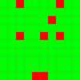
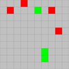

# Me


# 自动化计算时间

`./time_eval.py`

## 文件名字格式

`p<problemid>.[????.]<ext>`

如 `p101.speed3.py` `p233.cpp` `p1.rs`

## 目前超时1min

自动掐断+ 设置巨大时间 1000000

## 支持格式

目前支持了py(python3) cpp(clang++ std=gnu17) rs(rust) go(go) js(node) txt(plain text) sh(shell)

## 自动测时结果

[timecost/README.md](../ProjectEulerTimeCost/README.md)

根据结果绘制图片, 大于1min红色

```
./draw_time.py
```

1-100


101-200



201-300


301-400


401-500


501-600



601-700


701-800


801-900


# If you photocopy a crossword solution then what have you achieved?


